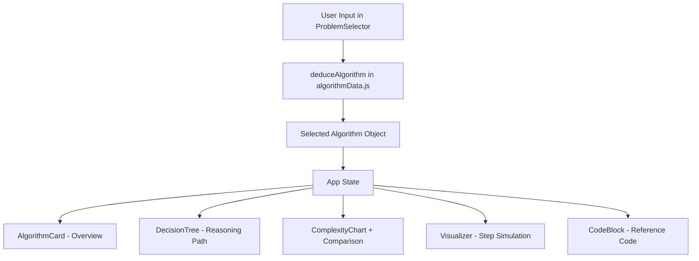

# Algorithmaze

Algorithmaze is an interactive algorithm recommendation and visualization web app.  
It helps learners choose the right algorithm for a problem type, understand *why* it is selected, compare complexity, simulate behavior step-by-step, and view reference code.

---

## What This Project Does

Algorithmaze guides users through a small decision questionnaire and maps answers to a suitable algorithm or data structure technique.  
After selection, the app provides:

- A plain-language overview
- A decision flow explanation
- Time/space complexity comparison
- Interactive visual simulation
- Syntax-highlighted code snippet

This makes it useful for students, interview prep, and quick algorithm intuition-building.

---

## Tech Stack

### Frontend
- **React 19** (component-driven UI)
- **Vite 8** (fast dev server and build pipeline)
- **JavaScript + JSX** (ES modules)

### Styling and UI
- **Tailwind CSS 4**
- **PostCSS + Autoprefixer**
- **Framer Motion** (animations/transitions)
- **Lucide React** (icons)

### Data Visualization and Code Display
- **Recharts** (complexity charts)
- **react-syntax-highlighter** (code view)

### Tooling
- **ESLint 9** (code quality)
- **gh-pages** (deployment to GitHub Pages)

---

## Core Features

- Problem-driven recommendation engine (`deduceAlgorithm`)
- Coverage across:
  - Searching
  - Sorting
  - Graph
  - String Matching
  - Data Structures
  - Tree Operations
  - Hashing Techniques
- Step playback controls (play, pause, replay, reset)
- Tabbed learning layout:
  - Overview
  - Decision Flow
  - Complexity
  - Visualizer
  - Code

---

## Supported Algorithms and Techniques

### Searching
- Binary Search
- Linear Search

### Sorting
- Quick Sort
- Merge Sort
- Insertion Sort
- Selection Sort

### Graph
- BFS
- DFS
- Dijkstra
- Bellman-Ford

### String Matching
- Naive String Matching
- KMP

### Data Structures
- Stack
- Queue
- Linked List

### Tree
- Traversals
- Find Minimum (BST)
- Find Maximum (BST)
- Find Kth Minimum
- Find Kth Maximum

### Hashing
- Linear Probing
- Quadratic Probing
- Double Hashing
- Random Probing
- Rehashing

---

## Project Structure

```text
Algorithmaze/
|- public/
|  |- icons.svg
|- src/
|  |- components/
|  |  |- Navbar.jsx
|  |  |- HeroSection.jsx
|  |  |- ProblemSelector.jsx
|  |  |- AlgorithmCard.jsx
|  |  |- DecisionTree.jsx
|  |  |- ComplexityChart.jsx
|  |  |- ComplexityComparison.jsx
|  |  |- Visualizer.jsx
|  |  |- TreeTraversalVisualizer.jsx
|  |  |- CodeBlock.jsx
|  |- utils/
|  |  |- algorithmData.js
|  |- App.jsx
|  |- main.jsx
|  |- index.css
|- index.html
|- package.json
|- vite.config.js
|- tailwind.config.js
|- postcss.config.js
|- eslint.config.js
```

---

## Architecture Overview

Algorithmaze follows a **single-page, component-based architecture** with a centralized algorithm knowledge base.



### Main Module Responsibilities

- `src/App.jsx`  
  Orchestrates app layout, selected algorithm state, and tab switching.

- `src/utils/algorithmData.js`  
  Stores algorithm metadata (complexity, explanation, code, alternatives) and recommendation logic.

- `src/components/ProblemSelector.jsx`  
  Captures user intent through category-specific questions.

- `src/components/Visualizer.jsx`  
  Runs domain-specific simulations and playback controls.

- `src/components/ComplexityChart.jsx` and `src/components/ComplexityComparison.jsx`  
  Visual and tabular complexity comparisons.

- `src/components/CodeBlock.jsx`  
  Displays syntax-highlighted example code for the selected algorithm.

---

## How Recommendation Works

1. User chooses a problem category.
2. User answers one focused question set.
3. `deduceAlgorithm(problemType, answers)` maps responses to a best-fit algorithm.
4. The selected algorithm object drives all tabs (overview, decision flow, complexity, visualizer, code).

This keeps logic deterministic and easy to maintain/extend.

---

## Getting Started

### Prerequisites
- Node.js (LTS recommended)
- npm

### Installation

```bash
npm install
```

### Run Locally

```bash
npm run dev
```

Open the local URL shown by Vite (usually `http://localhost:5173`).

---

## Available Scripts

- `npm run dev` - Start development server
- `npm run build` - Create production build
- `npm run preview` - Preview production build locally
- `npm run lint` - Run ESLint checks
- `npm run deploy` - Build and publish `dist` via GitHub Pages

---

## Deployment

This project includes `gh-pages` deployment support.

```bash
npm run deploy
```

It runs the build (`predeploy`) and publishes the `dist` folder to GitHub Pages.

---

## Extending the Project

To add a new algorithm:

1. Add its object in `src/utils/algorithmData.js`
2. Extend `problemTypes` question options if needed
3. Update `deduceAlgorithm` mapping logic
4. Add simulation handling in `src/components/Visualizer.jsx` (if interactive support is required)

---

## Why This Design Works

- **Beginner-friendly:** starts from problem intent instead of algorithm memorization
- **Explainable:** every recommendation includes reasoning path and alternatives
- **Interactive:** visual simulation makes abstract behavior concrete
- **Modular:** algorithm knowledge and UI are clearly separated

---

## Author

Designed and developed by **Krishna**.
